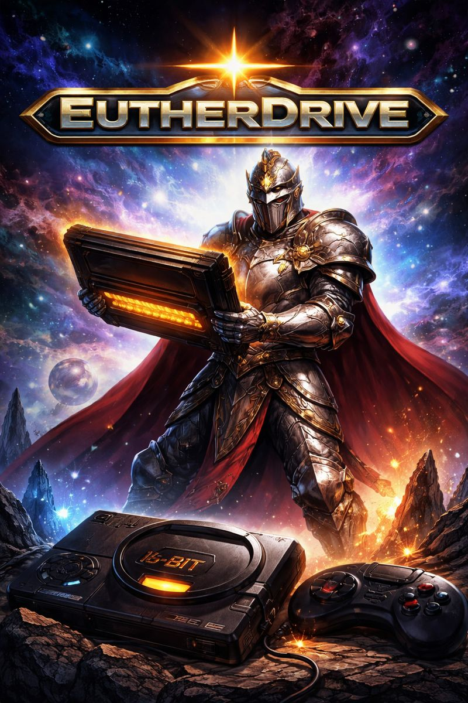

# EutherDrive



EutherDrive is a Mega Drive / Genesis emulator written in C# with [Avalonia UI](https://avaloniaui.net/) as the frontend.
It now also includes PC Engine (HuCard) and PC Engine CD support.
The project is based on core code from [MDTracer](https://github.com/sasayaki-japan/MDTracer) (MIT license) and extends it with a modern, cross-platform UI and improved compatibility.

The emulator also runs Sega Master System games. All titles tested so far work, including Korean mappers and Codemasters titles.

Basic SNES support is integrated via the SuperNintendoEmulator project (see references below).
Basic NES support is integrated via XamariNES (see references below).

The SNES implementation has been extended with special chips and a new audio engine, mostly ported from jgenesis.
EutherDrive now runs many SNES titles.

PC Engine (HuCard) and PC Engine CD are supported. A CD BIOS is required.
CD audio support is still work in progress.

A future plan is to integrate ProjectPSX into the UI to continue development toward playable PSX titles.

## Features
- Loads and runs Mega Drive ROMs directly from a file picker
- Basic SNES support (via separate core)
- PC Engine (HuCard) and PC Engine CD support
- Avalonia-based frontend (Windows, Linux, macOS, Android)
- Keyboard and gamepad input handling
- Audio output via Pipewire on Linux (Android fork planned)
- Savestates (3 slots per ROM, one save file per ROM)
- SRAM saving
- Interlace support, including Sonic 2 interlaced mode
- PAL/NTSC switch
- Region handling

## PC Engine CD BIOS
You can set the PC Engine CD BIOS in two ways:

1. In the UI (recommended):
- Open the left menu.
- Use the `PCE BIOS` section.
- Click `Select BIOS...` to choose a BIOS file.
- Use `Clear` to remove the override.

2. Automatic BIOS lookup fallback:
- Place a BIOS file in `EutherDrive/bios/` with one of these names:
- `syscard3.pce`, `syscard2.pce`, `syscard1.pce`, `systemcard.pce`, `bios.pce`

Note: explicit Arcade Card emulation is not implemented yet.

## DSP BIOS
DSP1/DSP2/DSP3/DSP4 support expects the coprocessor ROM to be present in the repository BIOS folder.

- Default files:
  - `EutherDrive/bios/DSP1.bin`
  - `EutherDrive/bios/DSP2.bin`
  - `EutherDrive/bios/DSP3.bin`
  - `EutherDrive/bios/DSP4.bin`

If you want to override it, set:

```bash
EUTHERDRIVE_DSP1_ROM=/full/path/to/DSP1.bin
EUTHERDRIVE_DSP2_ROM=/full/path/to/DSP2.bin
EUTHERDRIVE_DSP3_ROM=/full/path/to/DSP3.bin
EUTHERDRIVE_DSP4_ROM=/full/path/to/DSP4.bin
```

## ST018 BIOS
ST018 support expects the enhancement-chip ROM set to be present in the repository BIOS folder.

- Default files:
  - `EutherDrive/bios/st018.program.rom`
  - `EutherDrive/bios/st018.data.rom`

The loader will combine those two files automatically. A pre-concatenated blob is also accepted if
you point `EUTHERDRIVE_ST018_ROM` at it.

If you want to override it, set:

```bash
EUTHERDRIVE_ST018_ROM=/full/path/to/st018.rom
```

## ST010 BIOS
ST010 support expects the coprocessor ROM to be present in the repository BIOS folder.

- Default file:
  - `EutherDrive/bios/st010.bin`

If you want to override it, set:

```bash
EUTHERDRIVE_ST010_ROM=/full/path/to/st010.bin
```

## ST011 BIOS
ST011 support expects the coprocessor ROM to be present in the repository BIOS folder.

- Default files:
  - `EutherDrive/bios/st011.bin`
  - `EutherDrive/bios/st011.rom`

If you want to override it, set:

```bash
EUTHERDRIVE_ST011_ROM=/full/path/to/st011.bin
```

## Keyboard Shortcuts (UI)
- `F1`: Fullscreen
- `F5`: Save Slot 1
- `F6`: Save Slot 2
- `F7`: Save Slot 3
- `F8`: Load Slot 1
- `F9`: Load Slot 2
- `F10`: Load Slot 3

## Installation
Build from source with .NET 8:

```bash
git clone https://github.com/[your-account]/EutherDrive
cd EutherDrive
dotnet build
dotnet run --project EutherDrive.UI
```

## References
- https://github.com/sasayaki-japan/MDTracer-Genesis-megadrive-Emulator
- https://github.com/Kookpot/SuperNintendoEmulator
- https://github.com/unknowall/emuPCE
- https://github.com/enusbaum/XamariNES
- https://github.com/jsgroth/jgenesis
- https://github.com/BluestormDNA/ProjectPSX

## TODO
- Fix Z80-dependent audio behavior (currently broken)
- Implement player 2 controls
- Complete joypad support
- Add touchscreen control overlay for Android
- Potentially implement a more accurate HBLANK method based on `TODO.md`
