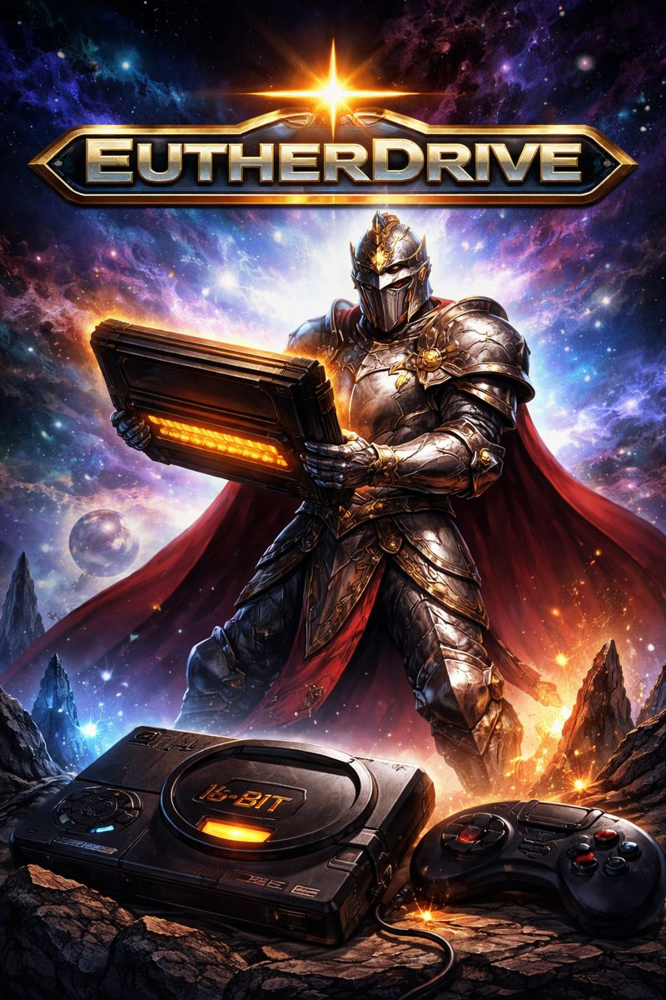

# EutherDrive



EutherDrive is a multi-system emulator frontend and core collection written in C# with [Avalonia UI](https://avaloniaui.net/).
It started as a Mega Drive / Genesis project based on [MDTracer](https://github.com/sasayaki-japan/MDTracer) and has since grown into a unified desktop + Android emulator shell with shared savestates, ROM management, BIOS handling, and cover art caching.

## Current Status
EutherDrive currently has active UI integration for:

- Mega Drive / Genesis
- Sega CD
- Master System
- Game Gear
- Game Boy
- Game Boy Color
- Game Boy Advance
- NES
- SNES
- PC Engine / TurboGrafx-16 HuCard
- PC Engine CD
- N64
- PSX

The most mature paths right now are the Mega Drive family, Master System / Game Gear, Game Boy / Game Boy Color, Game Boy Advance, PSX, and the desktop/Android frontend itself.

## Frontends
- Desktop frontend: Avalonia UI on Linux / Windows / macOS
- Android frontend: dedicated `EutherDrive.Android` head with ROM picker, settings, savestates, Android audio, and mobile render backend selection
- Headless frontend: `EutherDrive.Headless` for regression testing, savestate boot, frame dumping, and debug probes

## Core Features
- Shared ROM picker with library navigation, drive picker, search, sorting, stars, launch counts, and play-time stats
- Desktop ROM picker cover art with offline cache and Libretro thumbnail sync
- Shared savestate system with 3 slots per ROM
- SRAM / battery save handling
- Keyboard and gamepad input
- BIOS selection in UI where required
- Audio/video backend abstraction for desktop and Android
- Archive-aware ROM detection for `.zip` / `.7z` where supported

## System Notes
- Mega Drive / Genesis remains the original core path and still forms the base for several Sega-family integrations
- Master System and Game Gear are integrated through the newer `SmsGgAdapter` path
- Game Boy / Game Boy Color are integrated through `GbAdapter`, with the adopted core based on `gameboy_sharp`
- Game Boy Advance is integrated with BIOS support and software-renderer optimizations
- SNES support includes multiple enhancement-chip paths and newer audio work
- PC Engine CD requires a BIOS and remains an active compatibility area
- PSX is integrated and working well in current testing, including support for `.sbi` data used by protected discs
- N64 is wired into the frontend, but still needs significantly more work before it should be treated as usable

## Savestates
Savestates are now a first-class feature in the project rather than a one-off debug path.

- Desktop UI has an integrated savestate panel
- Android has savestate support in its UI flow as well
- The headless runner can boot from savestates and run scripted validation from them
- The shared savestate service stores 3 slots per ROM identity

Keyboard shortcuts in the desktop UI:

- `F1`: Fullscreen
- `F5`: Save Slot 1
- `F6`: Save Slot 2
- `F7`: Save Slot 3
- `F8`: Load Slot 1
- `F9`: Load Slot 2
- `F10`: Load Slot 3

## ROM Picker Covers
The desktop ROM picker can download and cache cover art in the background for the configured ROM library only.

- Cover art is fetched from the Libretro thumbnail repository/server
- The local cache is stored under `ROM_LIBRARY/.eutherdrive-thumbnails`
- Matching first reuses the local cache/index, then tries No-Intro DAT title resolution by CRC32, and finally falls back to Libretro-style filename matching
- System DAT files are cached under `ROM_LIBRARY/.eutherdrive-thumbnails/.dat-cache`
- DAT metadata is refreshed only when missing or stale, not on every picker open
- The picker only scans the selected ROM library, not the whole computer
- Opening the picker uses the existing cache immediately; `Sync Covers` performs a full refresh, while lightweight delta sync can pick up newly added ROMs

Current source:
- `https://thumbnails.libretro.com/`

This is intentionally an offline-friendly cache once downloaded. Libretro thumbnails remain the image source, while canonical names are improved locally with cached DAT metadata for better match rates on renamed files, archives, and mixed sets.

## BIOS Support
The UI currently exposes BIOS selection for the systems that need it most in normal use.

## PC Engine CD BIOS
You can set the PC Engine CD BIOS in two ways:

1. In the UI (recommended):
- Open the left menu.
- Use the `PCE BIOS` section.
- Click `Select BIOS...` to choose a BIOS file.
- Use `Clear` to remove the override.

2. Automatic BIOS lookup fallback:
- Place a BIOS file in `EutherDrive/bios/` with one of these names:
- `syscard3.pce`, `syscard2.pce`, `syscard1.pce`, `systemcard.pce`, `bios.pce`

Note: explicit Arcade Card emulation is not implemented yet.

## GBA BIOS
You can set the GBA BIOS from both desktop and Android UI.

- Desktop: use the `GBA BIOS` section in the left-side settings
- Android: use the `GBA BIOS` entry in the Android settings page

Default fallback location:

- `EutherDrive/bios/gba_bios.bin`

## DSP BIOS
DSP1/DSP2/DSP3/DSP4 support expects the coprocessor ROM to be present in the repository BIOS folder.

- Default files:
  - `EutherDrive/bios/DSP1.bin`
  - `EutherDrive/bios/DSP2.bin`
  - `EutherDrive/bios/DSP3.bin`
  - `EutherDrive/bios/DSP4.bin`

If you want to override it, set:

```bash
EUTHERDRIVE_DSP1_ROM=/full/path/to/DSP1.bin
EUTHERDRIVE_DSP2_ROM=/full/path/to/DSP2.bin
EUTHERDRIVE_DSP3_ROM=/full/path/to/DSP3.bin
EUTHERDRIVE_DSP4_ROM=/full/path/to/DSP4.bin
```

## ST018 BIOS
ST018 support expects the enhancement-chip ROM set to be present in the repository BIOS folder.

- Default files:
  - `EutherDrive/bios/st018.program.rom`
  - `EutherDrive/bios/st018.data.rom`

The loader will combine those two files automatically. A pre-concatenated blob is also accepted if
you point `EUTHERDRIVE_ST018_ROM` at it.

If you want to override it, set:

```bash
EUTHERDRIVE_ST018_ROM=/full/path/to/st018.rom
```

## ST010 BIOS
ST010 support expects the coprocessor ROM to be present in the repository BIOS folder.

- Default file:
  - `EutherDrive/bios/st010.bin`

If you want to override it, set:

```bash
EUTHERDRIVE_ST010_ROM=/full/path/to/st010.bin
```

## ST011 BIOS
ST011 support expects the coprocessor ROM to be present in the repository BIOS folder.

- Default files:
  - `EutherDrive/bios/st011.bin`
  - `EutherDrive/bios/st011.rom`

If you want to override it, set:

```bash
EUTHERDRIVE_ST011_ROM=/full/path/to/st011.bin
```

## Installation
Build from source with .NET 8:

```bash
git clone https://github.com/[your-account]/EutherDrive
cd EutherDrive
dotnet build
dotnet run --project EutherDrive.UI
```

## Android Build
The Android version lives in `EutherDrive.Android/`.

- It is kept separate from the default desktop solution so normal desktop builds do not require Android workloads
- The Android app now includes its own ROM picker flow, settings, GB/GBC/GBA/PCE BIOS handling where applicable, savestates, and Android-specific audio/render paths

Install the .NET Android workload first:

```bash
dotnet workload install android
```

Android SDK tooling requires Java 17 or newer. The repo scripts default to `/usr/lib/jvm/java-17-openjdk`, while still respecting an explicit `JAVA_HOME`.

Then build the Android head:

```bash
scripts/build-android.sh
```

## References
- https://github.com/sasayaki-japan/MDTracer-Genesis-megadrive-Emulator
- https://github.com/Kookpot/SuperNintendoEmulator
- https://github.com/unknowall/emuPCE
- https://github.com/enusbaum/XamariNES
- https://github.com/jsgroth/jgenesis
- https://github.com/BluestormDNA/ProjectPSX
- https://github.com/Asphaltian/sgba
- https://github.com/sokie/gameboy_sharp

## TODO
- Continue improving Game Gear seed-core parity and remaining hybrid areas
- Keep improving PC Engine CD compatibility and audio behavior
- Expand Android touch-first controls and overlay UX
- Continue improving and documenting N64 support
- Keep iterating on render/audio performance hot paths where needed
