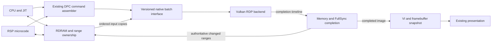

# N64 GPU rendering: measured starting point and integration plan

Scope: the Linux N64 emulator, starting from `19ba64c1`. The existing CPU/RSP
optimizations remain the baseline. This checkpoint adds offline tools; it does
not select a different renderer in the running application.

## What the moving Mario profile changes

The preceding stationary test was about 88% real time. The 120-second scripted
movement test produced 65.36 seconds of audio in 121.63 wall seconds, about
54%. Those are different scenes, not interchangeable performance estimates.

This investigation sampled the emulator's busiest thread for 15 seconds,
starting approximately 46 seconds into a fresh 75-second movement run. Mario
is swimming in the captured image at second 60. Inputs are the existing
`N64_PROBE_SM64_INPUT` script: A every fourth poll and forward after poll 20.
The build, normalized USA ROM and starting core state are unchanged. The
native sampler perturbs execution; this run is a profile, not an A/B timing.

Of 29,959 instruction-pointer samples, 29,576 mapped to managed methods. The
80 most sampled methods account for 91.37% of all samples. Grouping their
exclusive instruction locations gives:

| Named methods in the top 80 | Share of all samples |
| --- | ---: |
| CPU execution, memory ticking and other runtime methods | 47.36% |
| RSP methods and RSP progress checks | 22.45% |
| RDP methods | 21.56% |
| Remaining methods / native or unmapped locations | 8.63% |

Individual hot methods include `InterpretOpcode` (7.32%), `Memory.Tick`
(6.62%), RGBA16 filtering (5.98%), `TryAdvanceCpuBlock` (5.38%) and
`GetQuietCpuCycles` (5.33%). Unlike the stationary profile, ordinary CPU
interpretation and event scheduling are major targets. This is exclusive
sampling, not an inclusive call-tree attribution or a confidence interval.

The profile supports doing GPU work, but does not support promising that GPU
work alone will deliver real time. Illustratively, removing 22% of total cost
would multiply throughput by 1 / 0.78 = 1.28. That is not the 1.85 multiplier
needed to turn 54% into 100%. The sample and 54% measurement cover different
windows, so this calculation is a planning illustration, not a measured bound.

Continue a separate CPU track: collect costly PCs, JIT eligibility and rejection
reasons during movement; then test hot-code admission and supported block
coverage. The cache reaches its 128-version limit, but increasing it to 2048
already lost in the stationary benchmark. Do not repeat that as an assumed win.
Use saved moving scenes and guest-cycle-based input for paired measurements.

## Backend choice and verified host

Preferred experiment: wrap [paraLLEl-RDP](https://github.com/Themaister/parallel-rdp)
behind a small native C ABI, retaining the existing RSP microcode execution.
It already implements an N64 raster pipeline with Vulkan compute. Writing our
own complete rasterizer would duplicate substantial coverage, combiner, TMEM,
depth and VI work. Our existing arcade Voodoo GPU probe provides useful
experience with synchronization and measurements, but its shaders implement a
different GPU and cannot render N64 command streams.

The external checkout used here is pinned to
`1cecd042b2619bc505c12bfdc713808386f2b54d`, with Granite
`cf71dee71fb00110749a9a3fcbd87b0297e49b6a` and the associated submodules.
The backend's [license](https://github.com/Themaister/parallel-rdp/blob/master/LICENSE)
is MIT. The offline reference has a separate legacy MAME license: its code and
the `rdp-utils` test dependency graph must not enter the emulator binary.
Production packaging must use the standalone backend dependency list and
retain its dependency notices. No upstream source or test binary is vendored
by this checkpoint.

Live host inspection found an RTX 4090, NVIDIA driver 615.71.09 and Vulkan
device API 1.4.351. It exposes 8/16-bit storage, timeline semaphores, subgroup
size control and `VK_EXT_external_memory_host`, with 4096-byte imported-pointer
alignment. The upstream README's 2020 NVIDIA limitation is not applicable to
this inspected driver. This says nothing yet about other machines.

`OpenGlRenderSurface` and `VulkanRenderSurface` currently upload/present the
already rendered framebuffer. Changing that UI selector does not offload the
software RDP in `Ryu64.MIPS/Memory.cs`.

## First proof and its limits

`N64Probe --export-rdp-dump` bridges a complete existing command tape to
`RDPDUMP2`. It preserves command-word endianness and joins partial commands in
arrival order, including Rampage's ring wrap and source changes. It supplies
initial RDRAM and hidden bits in the native reference's word-swapped layout.

`tools/N64GpuProbe` feeds this explicit input to paraLLEl-RDP and Angrylion,
compares the complete 8 MiB RDRAM, 4 MiB hidden memory and 4 KiB TMEM, writes
raw framebuffer images, and provides a deliberately corrupted oracle control.
Its timing mode restores initial memory outside the rendering timer, submits
the frame, waits for GPU completion, and checks repeatability outside timing.
This is a renderer experiment, not an emulator speed measurement.

The exporter produces a manifest spelling out what the old tapes lack:

- They capture a single initial memory snapshot and command bytes, not all
  CPU/RSP writes between texture loads. Command staging writes are not modeled
  as memory updates; command/texture aliasing is untested.
- They start at a SyncPipe, not a hardware reset. Initial scissor/color/depth
  state is reconstructed from software state. Scissor subpixel/interlace bits
  and primitive LOD fields cannot be recovered from that state.
- Initial TMEM, tile state and convert/key state are not restored. Observed
  frame commands initialize much of this state, but that is not a general
  savestate import contract.
- VI scanout, interrupt timing and live CPU/GPU coherence are outside the proof.

Consequently, a GPU/reference match validates the **explicit replay input**.
It does not establish that the input perfectly reconstructs the original game
frame. Differences against our software framebuffer must be investigated,
not silently treated as either a GPU bug or an accuracy improvement.

## Implementation stages and acceptance gates

Planned boundary (only offline replay exists in this checkpoint):



### 1. Make the recording boundary complete

Progress: [the ordered-journal checkpoint](n64-rdp-journal-2026-09-21.md)
implements complete-command capture, exact external write ranges, strict
software replay and 20-checkpoint reset replay against the GPU/reference.
CPU-read dependencies and DPC/VI event timing remain open; the full gate below
is not yet satisfied. Normal-build Memory IL is unchanged.

Add an opt-in capture build at the common point where `ExecuteRdpDisplayList`
has assembled one complete command. Keep the existing partial-command buffer
and CURRENT advancement unchanged. Record:

- Raw RDP register commands from reset, including key, convert, scissor,
  other-modes and primitive LOD bits; all TMEM load commands and their inputs.
- Ordered CPU/RSP/PI writes to RDRAM, with payloads and sequence numbers.
  A DMA-length/dirty notification without the old bytes is insufficient when
  a buffer is reused before the consumer runs.
- FullSync, DPC boundaries, relevant CPU reads, VI register writes and scanout
  boundaries. Preserve command-source switches and unfinished commands.
- Enough bootstrap state to replay without guessing. Prefer short boot-to-
  scene recordings first; only then add a versioned compact snapshot format.

Gate: deterministic replay reproduces the captured software color, depth,
hidden bits and interrupts. Hardware-reference comparisons use the same
ordered input. Validate negative controls and split-command save/load cases.
Old frozen-input tapes remain useful component fixtures, labeled as such.

### 2. Native backend boundary, still headless

Progress: [the native boundary checkpoint](n64-native-gpu-2026-09-21.md)
adds a permissive-only shared library, a SafeHandle C# adapter and exact
multi-frame replay. Conservative dependency batching cuts measured warm
startup-journal transfer/render/readback from about 159 to 6 ms. This is not
live gameplay or a comparison against the current software renderer.

Build a small shared library from the permissive backend and its required
dependencies only. Proposed ABI operations: create/destroy, submit complete
command batches, stage CPU memory ranges, flush/wait for a timeline, retrieve
completed color/depth/hidden data, and report capability/error status. Version
the ABI and catch native errors before crossing into managed code.

Dispatch at command/batch boundaries, never per pixel. Keep MIPS execution,
RSP execution, DPC register emulation and MI interrupts in the emulator. The
backend reports completion; it does not raise a speculative DP interrupt.
Retain the software implementation as the correctness and fallback path.

Memory layout is a real design decision: `Memory.RDRAM` is a public readonly
managed byte array using big-endian bytes. The native backend uses word-swapped
memory, and imported host pointers require alignment. Pinning the array does
not provide alignment or fix byte order. Begin with an explicit native staging
mirror and measure copy/byte-swap costs. A later native-owned RDRAM allocation
would require auditing every CPU, JIT, DMA and savestate access; it is not a
small interop optimization.

Gate: replay tests include managed/native submission, required transfers,
completion and readback in wall time. Report this separately from GPU timestamp
time, shader compilation, file I/O and memory initialization. Reject a design
that saves shader time but increases end-to-end frame cost.

### 3. Live rendering with explicit memory ownership

Before letting emulation overlap GPU work, add a page/range ownership model:
CPU-visible, pending GPU read, pending GPU write and completed GPU data. Order
texture uploads with the commands that consume them. Never overwrite pending
GPU output by copying a stale full-RDRAM mirror back to the device.

CPU reads or DMA reads of pending GPU output flush and wait before returning.
CPU writes to pending GPU source or destination ranges preserve ordering,
through immutable staged versions or a wait before reuse. Nonoverlapping work
can proceed. All access paths count: interpreted memory access, JIT fast paths,
RSP DMA, PI/SI transfers and bulk helpers. GPU writes must also invalidate
appropriate CPU/JIT-derived memory state.

Initially complete every FullSync before raising the existing DP interrupt.
Also synchronize on actual memory hazards, framebuffer consumers, target
changes where required, save/load and reset. FullSync alone is not a complete
memory-coherency scheme. Conversely, waiting after every DPC_END would create
thousands of GPU submissions/waits per frame and discard the expected benefit.

Publish completed framebuffer snapshots using the current visibility rules.
Keep CPU/RSP timing and game instruction counts unchanged. If a device fails,
return to software only from a coherent checkpoint; replaying half a GPU batch
in software against already modified memory is invalid.

Gate: five-game live runs, continuous audio and input, no synthetic completion
interrupts, no half-drawn frames, and assertions for ownership violations.
Exercise Rampage's ring wrap/freeze and Duke's transparency/depth regressions.

### 4. Savestates and lifecycle

Quiesce submissions and bring authoritative memory back before saving. Version
raw RDP state, TMEM, hidden bits, pending command words and necessary VI history.
Loading discards outstanding work and derived GPU caches, restores state and
rebuilds device resources. No stale completion may survive a load or reset.

Existing v1–v7 memory states do not contain all raw hardware bits needed for a
lossless hardware-renderer import. Keep them working in software. A transition
after restore requires an observed, sufficiently initialized RDP state or an
explicit validated importer; do not approximate old saves silently. Save slots
must not be rewritten merely to test the GPU backend.

Gate: save/reload mid-command and at FullSync, repeated start/stop, renderer
failure and device recreation, with identical continued guest state. Test both
new saves and the existing Mario, Rampage, Duke, Gauntlet and Perfect Dark saves.

### 5. VI and frontend integration

First use completed CPU-readable images through the existing presentation path.
That keeps the RDP integration independently testable. Then move VI filtering
and scanout to the backend and consider sharing completed images/semaphores
with the frontend. Native Vulkan presentation and OpenGL external-memory
interop are separate implementation paths; avoid assuming an Avalonia GL
texture can directly consume any Vulkan image.

Gate: correct VI origin/stride/cropping/interlace, stable presentation through
resize and renderer changes, and lower measured total transfer/presentation
cost. Measure new game frames separately from UI polling and display refresh.

### 6. Enable only after gameplay measurements

Use fixed guest-cycle windows with recorded controller input in stationary,
walking, swimming and busy scenes. Alternate software/GPU runs on the same
CPU affinity; separate cold shader-cache stalls from warm steady operation.
Report simulated time / wall time, audio duration, new frame cadence, CPU time,
GPU time and CPU wait time. Include 30-minute gameplay and save/reload loops
before selecting GPU rendering by default on supported Linux machines.

The success criterion is faster correct gameplay. Keep CPU/RSP work progressing
alongside the GPU milestones; do not multiply isolated speedups into a promised
100% result.

## Local evidence

Artifacts: `.build-tmp/n64-gpu-plan-2026-09-21/`. Movement profile:
`moving-native/native-summary.json`, `native-ips.txt`, `native-perf.map`,
`native-game.log`, `native-game/frame-0060.png` and a separate copied core state.
The user's save slots and running application are untouched.

## Results of the first proof

All three explicit inputs pass the independent reference comparison:

| Fixture | Original tape chunks | Reassembled commands | GPU/reference comparison |
| --- | ---: | ---: | --- |
| Mario castle | 2,604 | 2,604 | All 12,587,008 bytes identical |
| Mario swimming | 1,013 | 1,005 | All 12,587,008 bytes identical |
| Rampage | 1,980 | 1,839 | All 12,587,008 bytes identical |

Each dump additionally contains eight documented bootstrap commands. Tests ran
with Khronos validation and explicitly enabled synchronization validation;
all three returned zero validation errors. Each also detected exactly one
injected framebuffer-byte difference. The exporter passed 102 split-command,
source/ring-change, byte-order and malformed-input cases. The existing 197
RDP streaming cases also pass, including save/load and trailing interrupts.

The new swimming capture starts after the previous FullSync. Replaying it
through the unchanged software renderer matches its captured framebuffer
exactly, SHA-256
`10bfe1452db89eec8391113de3cd63fa7130780944e6b9ddebb8804f566ac319`.

There was one driver/compiler-path issue to resolve: the upstream default
32-bit arithmetic path on NVIDIA emitted an 8-bit SPIR-V constant lacking the
required arithmetic capability. The initial Mario run matched memory but
reported three Vulkan errors and was **not accepted**. Selecting the existing
8/16-bit arithmetic path with `PARALLEL_RDP_SMALL_TYPES=1` passed all final
checks on this host. No validation errors were suppressed. Other GPUs and the
default 32-bit path remain unvalidated by this checkpoint.

Timing used normal builds pinned to CPUs 6,7, with no concurrent test/build
work. For each scene the order was software, GPU, GPU, software. Each software
result is the median of 40 runs after 60 warmups; each GPU result is 40 runs
after ten warmups and the initial cold frame. GPU timing disables validation
and uses `PARALLEL_RDP_FORCE_SYNC_SHADER=1` so pipeline compilation finishes
before warm measurements. Initial memory restoration, output checks and
frame-context advancement are outside these rendering timers. GPU timing includes enqueue and completion
waiting, not just device timestamps.

| Fixture | Software replay medians | GPU replay medians |
| --- | ---: | ---: |
| Mario castle | 15.248 / 15.387 ms | 2.544 / 2.465 ms |
| Mario swimming | 8.387 / 8.101 ms | 0.995 / 0.994 ms |
| Rampage | 7.208 / 7.010 ms | 1.487 / 1.575 ms |

These are component workloads with different renderer implementations and the
capture limitations above. They are not game-speed measurements. The raw GPU
images look coherent, but they differ from the software capture in 53,048 /
76,800 RGB pixels for Mario, 51,983 / 76,800 for swimming and 62,241 / 96,000 for
Rampage. Hardware dither/coverage/filtering behavior and bootstrap/capture
differences require investigation before claiming equivalence to live output.

A separate instrumented repeat measured the entire native fixture reset,
render and host-output-copy cycle. This uploads initial RDRAM/hidden memory
and retrieves/copies all 12 MiB plus TMEM, rather than only changed regions:

| Fixture | Full native reset/render/readback medians, two runs |
| --- | ---: |
| Mario castle | 5.480 / 5.895 ms |
| Mario swimming | 4.459 / 4.083 ms |
| Rampage | 4.704 / 4.835 ms |

The extra roughly 3 ms makes the transfer design material. These totals
exclude managed/native marshaling, byte-order conversion, frame-context
advancement, VI and frontend presentation; they also include full hidden-memory initialization that a live
backend should not repeat every frame. They are an explicit cost boundary,
not a prediction of integrated speed. Keep memory resident across frames and
measure changed-range transfers in stage 2 before drawing gameplay conclusions.

Native cold frames took seconds while creating pipelines. Async compilation
and persistent shader caches belong in the integration plan; warm throughput
does not establish smooth first-use behavior.

Detailed logs and JSON summaries: `correctness-results.json`,
`performance-results.json`, `transfer-results.json`, the three `*-export/`
manifests and `*-final-checks/` images. GPU frame SHA-256 values:

```
Mario   bb7f44818533e952a0ad441653414f214434f6ced29ac0bcaa09682c0c086f90
Swim    ca0c106031c11851dd5b3003705afbaf161187bfc82fd754231b5a03e4355de3
Rampage 0b4837c34850a0a9485dba3fbe41faeef2328e1b9012ae0a5ad5237914a8354d
```

The .NET probe and native tools build successfully. There are no production
CPU/RSP/RDP changes in this checkpoint and no UI binary installation is needed.
